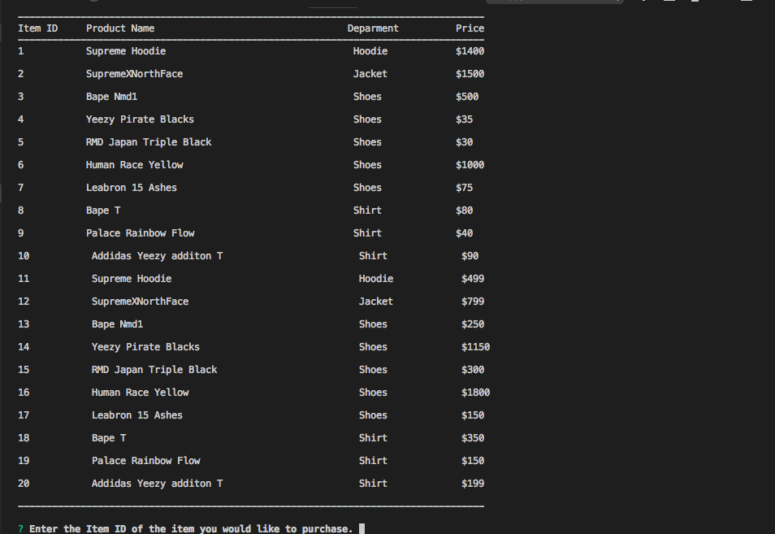
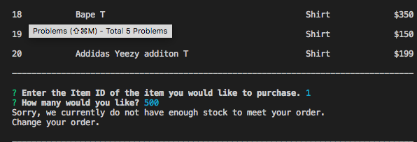
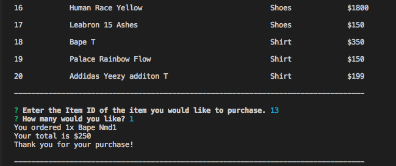

# Bamazon
Bamazon is a Amazon CLI to order products.

# How to run

1. Type `npm install` to download needed packages

2. In MySQL connect to `localhost:3306` run both `bamazon_schema.sql` and `bamazon_seeds.sql`.

3. In Terminal type `node bamazonCustomer.js` to run the application.

#Demo

You see products that are for sale, select them and purchase them in the shop.

To purchase an item select the item ID than enter the amount of them item you want.

If an Item it out of stock or not enough quanity of item was entered the user will be notifed and prompted to try again.

Once items and quanity are chosen the totals are added up and the user is notified that their order was successfully placed.

